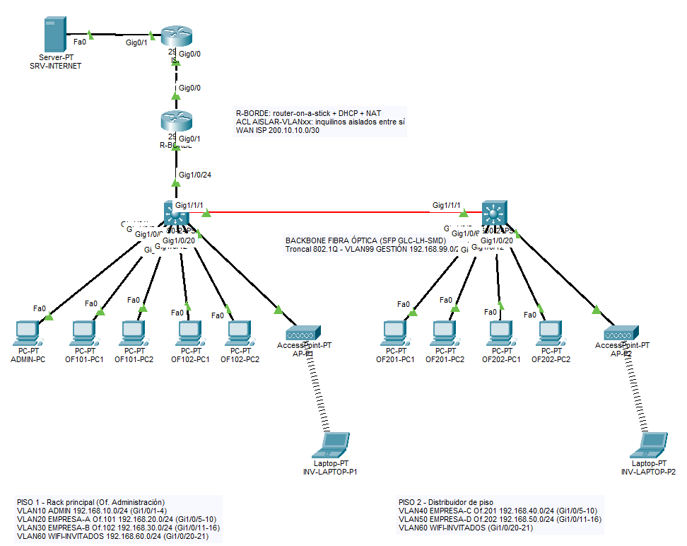
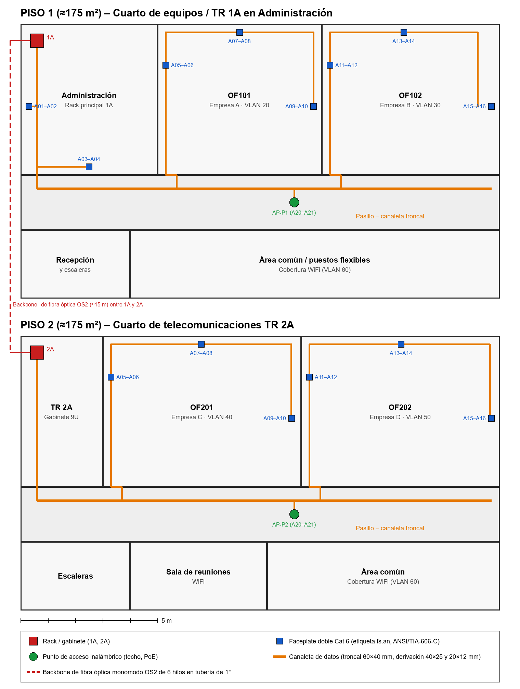

# Infraestructura de conectividad para un coworking multi-tenant

Diseño de cableado estructurado y validación en Cisco Packet Tracer de la red de un coworking de dos pisos (350 m²) que comparten cuatro empresas. Cada empresa tiene su propia red privada sobre una sola infraestructura física.

Proyecto de la asignatura **Cableado Estructurado**, Ingeniería de Sistemas, Corporación Unificada Nacional de Educación Superior (CUN), 2026.

| | |
|---|---|
| **Estudiantes** | Saúl Julián Gutiérrez Román · Rafael Antonio Rodríguez Gamarra · Sergio Esteban Veloza González |
| **Docente** | Kerwin Carlos Torres Castillo |
| **Entrega** | Ajuste y desarrollo avanzado del proyecto |



## El problema

Muchos coworkings pequeños funcionan con un router doméstico o un switch compartido entre todas las oficinas, con cables sin canalizar y pocos puntos de red. Así, todas las empresas quedan en la misma red: el tráfico de una puede verse desde otra, la red se congela en horas pico y cada nuevo arrendatario obliga a improvisar.

## La solución

| Capa | Decisión |
|---|---|
| Espacios | Cuarto de equipos y rack principal **1A** en la administración (piso 1) y gabinete **2A** en el piso 2, alineados verticalmente |
| Backbone | Fibra óptica monomodo **OS2 de 6 hilos** entre 1A y 2A (2 hilos en uso, 4 de reserva), con SFP 1000BASE-LX/LH |
| Cableado horizontal | **UTP categoría 6** en estrella hacia **32 salidas**; enlace máximo de 28 m (el límite es 90 m) |
| Puntos | 6 por oficina (4 en uso y 2 de reserva), 4 en administración y 2 por cada punto de acceso inalámbrico |
| Segmentación | Una VLAN por empresa, además de administración, invitados y gestión; **ACL** en el router que aíslan a los inquilinos |
| Administración | Etiquetado **ANSI/TIA-606-C** (`1A.A05` = piso 1, espacio A, panel A, puerto 05) |

Normas aplicadas: ANSI/TIA-568.0-D, ANSI/TIA-568.2-D, ANSI/TIA-569-D, ANSI/TIA-606-C, ISO/IEC 11801-1 y RETIE.

## Plan de red

| VLAN | Nombre | Red | Gateway (R-BORDE) | Puertos piso 1 | Puertos piso 2 |
|---|---|---|---|---|---|
| 10 | ADMIN | 192.168.10.0/24 | 192.168.10.1 | Gi1/0/1–4 | — |
| 20 | EMPRESA-A-OF101 | 192.168.20.0/24 | 192.168.20.1 | Gi1/0/5–10 | — |
| 30 | EMPRESA-B-OF102 | 192.168.30.0/24 | 192.168.30.1 | Gi1/0/11–16 | — |
| 40 | EMPRESA-C-OF201 | 192.168.40.0/24 | 192.168.40.1 | — | Gi1/0/5–10 |
| 50 | EMPRESA-D-OF202 | 192.168.50.0/24 | 192.168.50.1 | — | Gi1/0/11–16 |
| 60 | WIFI-INVITADOS | 192.168.60.0/24 | 192.168.60.1 | Gi1/0/20–21 | Gi1/0/20–21 |
| 99 | GESTION | 192.168.99.0/24 | 192.168.99.1 | SW-CORE-P1: .2 | SW-P2: .3 |
| — | WAN (ISP) | 200.10.10.0/30 | 200.10.10.2 | — | — |

- **Troncales 802.1Q:** Gi1/0/24 (SW-CORE-P1 → R-BORDE) y Gi1/1/1 (fibra entre pisos).
- **Router R-BORDE (Cisco 2911):** router-on-a-stick, DHCP por VLAN (se excluyen las direcciones .1 a .10), NAT con sobrecarga hacia el ISP y ruta por defecto.
- **Switches:** Cisco Catalyst 3650-24PS. Se eligió este modelo porque tiene ranuras SFP para la fibra y PoE para los puntos de acceso.
- **Internet simulado:** router ISP y servidor 8.8.8.8.

## Resultados de las pruebas

Pruebas ejecutadas en la simulación el 29 de septiembre de 2026:

| # | Prueba | Resultado |
|---|---|---|
| P1 | DHCP en todas las VLAN (11 equipos) | Cumple |
| P2 | Salida a Internet desde cada VLAN | Cumple |
| P3 | Empresa A → Empresa B (mismo piso) | Bloqueado, como se esperaba |
| P4 | Empresa A → Empresa C (otro piso) | Bloqueado, como se esperaba |
| P5 | Invitados → oficinas | Bloqueado, como se esperaba |
| P6 | Invitados → Internet | Cumple |
| P7 | Administración → todas las empresas | Cumple |
| P8 | Administración → gestión de los switches | Cumple |
| P9 | Backbone de fibra transportando todas las VLAN | Cumple |

La salida de consola de cada prueba está en [`img/`](img/) (figuras 3 a 8).

## Contenido del repositorio

| Archivo | Descripción |
|---|---|
| `Coworking-Multitenant.pkt` | Simulación en Cisco Packet Tracer |
| `img/` | Las 8 figuras y 13 tablas del proyecto en PNG |
| `topologia-coworking.png` | Captura de la topología |
| [`GUIA.md`](GUIA.md) | Guía de estudio del proyecto |

## Cómo abrir la simulación

1. Instala [Cisco Packet Tracer](https://www.netacad.com/cisco-packet-tracer), versión 8.x o posterior.
2. Abre `Coworking-Multitenant.pkt`.
3. Si la consola de un router o switch pregunta `Would you like to enter the initial configuration dialog?`, responde `no`. La configuración ya está cargada.
4. Para verificar, abre **Desktop → Command Prompt** en cualquier PC y ejecuta, por ejemplo:

```text
C:\> ipconfig
C:\> ping 8.8.8.8          (debe responder)
C:\> ping 192.168.30.11    (desde OF101-PC1: debe fallar, está bloqueado por ACL)
```

En los equipos de red:

```text
SW-CORE-P1# show vlan brief
SW-CORE-P1# show interfaces trunk
R-BORDE#    show ip dhcp binding
R-BORDE#    show access-lists
```

## Imágenes

| Figuras | Tablas |
|---|---|
| 1. Plano de distribución | 1. Normas aplicadas · 2. Puntos de red · 3. Cálculo de cable |
| 2. Topología en Packet Tracer | 4. Canalizaciones · 5. Separación eléctrica · 6. Racks |
| 3–4. VLAN y troncales | 7. Etiquetado · 8. Materiales · 9. VLAN y direccionamiento |
| 5–6. DHCP, ACL y NAT | 10. Matriz de pruebas · 11. Ajustes · 12. Riesgos |
| 7–8. Pruebas de ping | 13. Cronograma |



## Referencias principales

- Oppenheimer, P. (2011). *Top-down network design* (3.ª ed.). Cisco Press.
- Telecommunications Industry Association. ANSI/TIA-568.0-D (2015), 568.2-D (2018), 569-D (2015) y 606-C (2017).
- BICSI. (2014). *Telecommunications distribution methods manual* (13.ª ed.).
- Ministerio de Minas y Energía. (2013). *Reglamento técnico de instalaciones eléctricas (RETIE)*.
- Pogorelskiy, S. y Kocsis, I. (2024). Designing structured cabling systems documentation and model by using Building Information Modeling: Literature review. *Annales Mathematicae et Informaticae, 60*, 121–132. https://doi.org/10.33039/ami.2024.02.005
- Buladaco, M. V. M., Necio, G. C., Pilongo, O. B. y Timosan, J. Q. (2021). A proposed ideal network design for collaborative workspace businesses. *International Journal of Advanced Trends in Computer Science and Engineering, 10*(2), 440–445. https://doi.org/10.30534/ijatcse/2021/011022021
